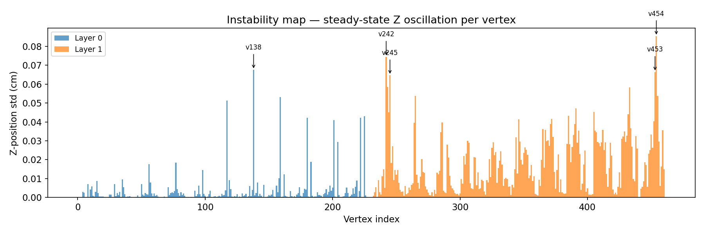
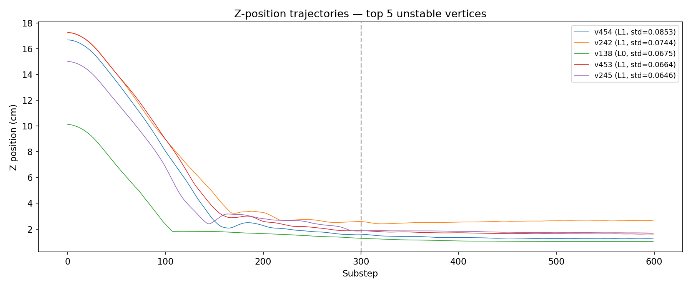
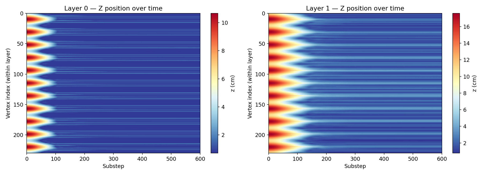
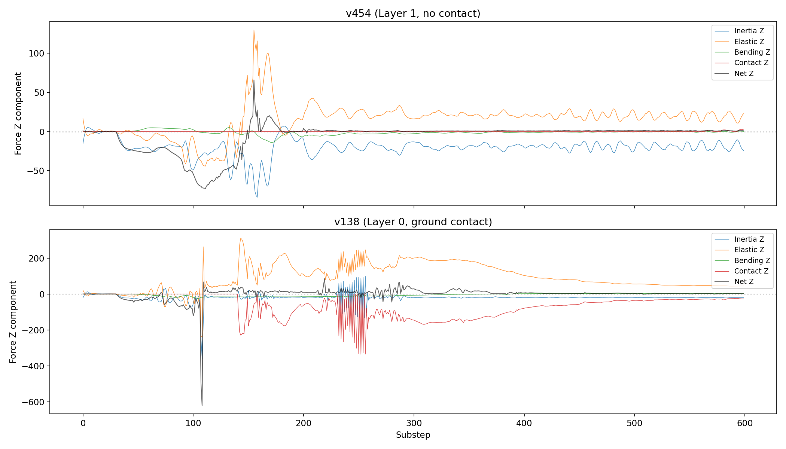
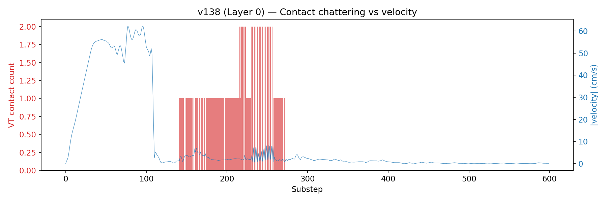
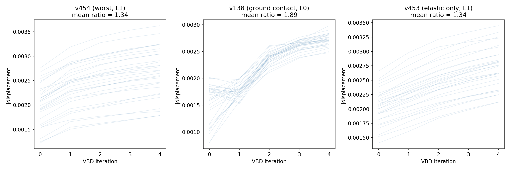
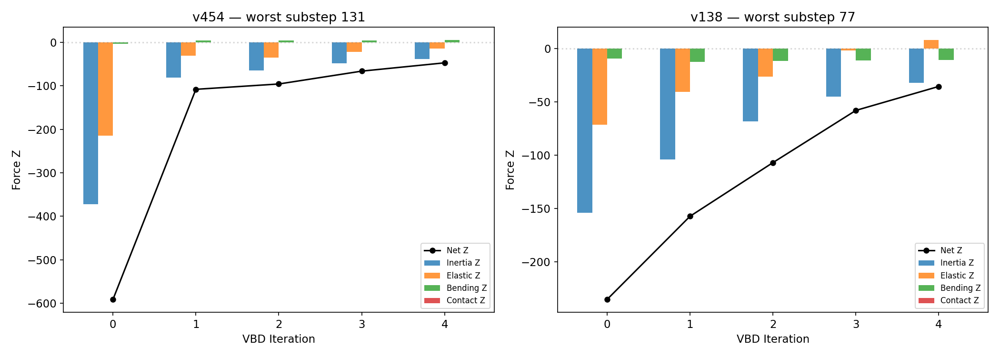
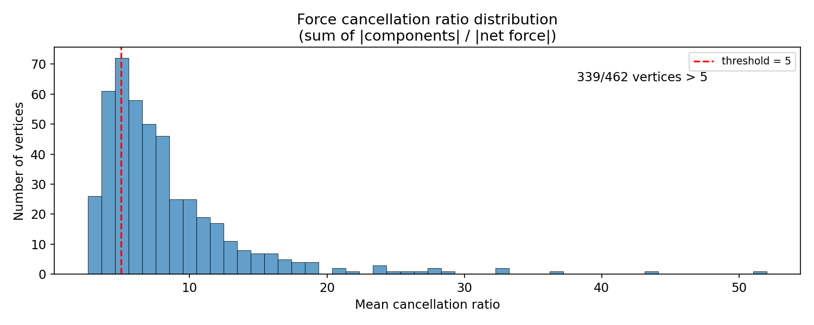
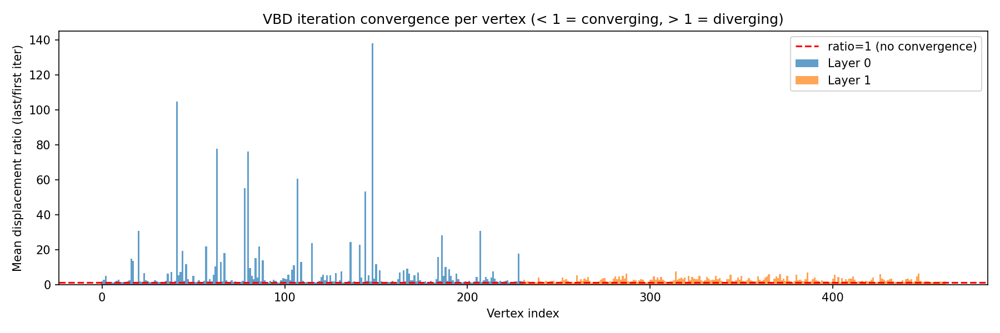
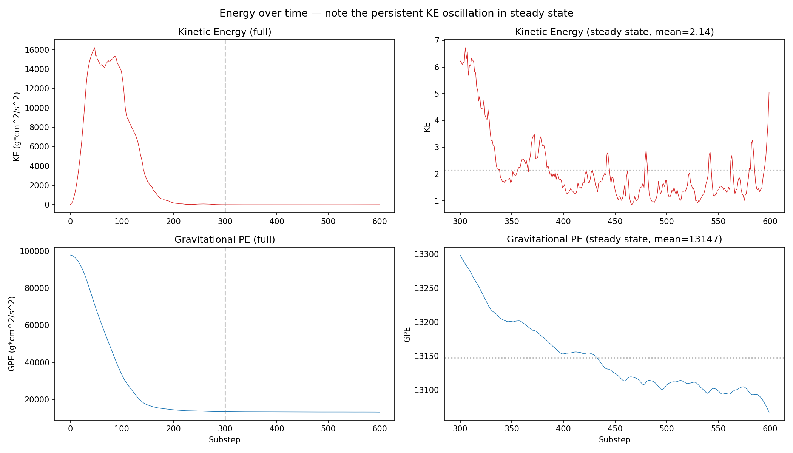

# VBD Contact Instability Analysis

**Experiment:** `grid_on_table.py --grid-n 20 --grid-ny 10 --layers 2 --tube`
**Date:** 2026-04-03
**Simulation:** 600 substeps (60 frames at 60 FPS, 10 substeps/frame), 5 VBD iterations/substep, 462 particles (2 layers of 231), cm-scale.

---

## 1. What Is VBD and How Does It Solve?

The Vertex Block Descent (VBD) solver computes cloth dynamics by solving a nonlinear optimization problem at each timestep. For each particle, the solver needs to find a position that balances four forces:

- **Inertia** — wants the particle to continue along its predicted trajectory (momentum)
- **Elasticity** — wants triangles to return to their rest shape
- **Bending** — wants edges to maintain their rest dihedral angle
- **Contact** — prevents penetration with other surfaces (ground, self-contact)

At equilibrium, these four forces sum to zero. The solver finds this equilibrium iteratively.

### The diagonal block approximation

VBD solves for each vertex independently using only its **local 3x3 Hessian block**:

```
displacement = H_local^{-1} * f_total
```

where `H_local` is the 3x3 matrix of second derivatives of energy with respect to *this vertex only*, and `f_total` is the sum of all force components acting on this vertex.

This is fast — each vertex solves a tiny 3x3 system. But it ignores **off-diagonal coupling**: the fact that moving vertex A changes the forces on its neighbors B, C, D, etc. The solver assumes neighbors stay fixed while computing each vertex's update. When this assumption is badly violated, the solver fails to converge.

### Graph coloring and iteration

Vertices are colored so that no two adjacent vertices share a color. Within one iteration, all vertices of the same color update simultaneously (they don't share edges, so they're "independent"). The solver cycles through all colors, then repeats for `N` iterations.

But vertices of *different* colors DO share edges. When color-1 vertices move, they change the elastic forces on color-2 vertices. This is the fundamental source of coupling that the diagonal block cannot capture.

---

## 2. The Experiment

We simulate two cylindrical tubes of cloth (20x10 grid rolled into a cylinder) stacked on a ground plane:

- **Layer 0** (bottom tube): rests on the ground plane
- **Layer 1** (top tube): rests on top of layer 0

The tubes' **rest shape is flat** (the mesh was built as a flat grid, then rolled into a cylinder). This means there is a permanent mismatch between the rest shape and the actual shape — the elastic energy is never zero. The elastic forces constantly try to flatten the tube.

### Parameters (cm-scale, matching T-shirt regime)

| Parameter | Value |
|-----------|-------|
| gravity | -981 cm/s^2 |
| tri_ke (elastic stiffness) | 1e4 |
| tri_ka (area stiffness) | 1e4 |
| edge_ke (bending stiffness) | 5.0 |
| contact_ke | 1e4 |
| particle_radius | 0.8 cm |
| density | 0.02 g/cm^2 |
| VBD iterations | 5 |
| substeps per frame | 10 |

---

## 3. Identifying Unstable Vertices

We measure instability as the **standard deviation of the Z-position** in the second half of the simulation (after the initial transient settles). Higher std = more oscillation.



**Figure 7:** Z-position oscillation amplitude per vertex. Layer 1 (top tube) is significantly more unstable than Layer 0 (bottom tube). The worst vertices oscillate with std > 0.08 cm.

The top-10 most unstable vertices:

| Rank | Vertex | Layer | Z-std (cm) |
|------|--------|-------|------------|
| 1 | 454 | 1 | 0.0853 |
| 2 | 242 | 1 | 0.0744 |
| 3 | 138 | 0 | 0.0675 |
| 4 | 453 | 1 | 0.0664 |
| 5 | 245 | 1 | 0.0646 |
| 6 | 243 | 1 | 0.0585 |
| 7 | 433 | 1 | 0.0582 |
| 8 | 265 | 1 | 0.0538 |
| 9 | 455 | 1 | 0.0537 |
| 10 | 159 | 0 | 0.0531 |

**8 out of 10** worst vertices are in Layer 1 (top tube). This makes sense: the bottom tube has ground contact anchoring it, while the top tube is only connected to the bottom via self-contact — a weaker constraint.

---

## 4. Z-Position Trajectories



**Figure 2:** Z-position over time for the 5 worst vertices. All show the same pattern:

1. **Initial collapse (substeps 0-100):** The tube falls and deforms under gravity. Z swings wildly from ~2 cm to ~16 cm.
2. **Slow settling (substeps 100-300):** Oscillation amplitude decreases but doesn't vanish.
3. **Persistent oscillation (substeps 300+):** The vertices never truly settle. They continue oscillating at ~0.05-0.08 cm amplitude indefinitely.

This is the instability: the simulation never reaches a static equilibrium even though the physical system should be at rest.



**Figure 1:** Z-position heatmap for all vertices over time. Layer 0 (left) settles quickly and stays put. Layer 1 (right) shows persistent oscillation across many vertices, especially in the middle region of the tube.

---

## 5. Force Analysis: What's Driving the Oscillation?

For each unstable vertex, we decompose the total force into its four components (inertia, elastic, bending, contact) and examine them at the last VBD iteration of each substep.



**Figure 3:** Force Z-components over time for two representative vertices.

### Vertex 454 (Layer 1, worst vertex): Pure elastic oscillation

| Component | Mean |f| | Max |f| |
|-----------|---------|---------|
| Inertia | 22.7 | 96.8 |
| Elastic | 25.8 | 207.5 |
| Bending | 2.5 | 18.8 |
| **Contact** | **0.06** | **2.8** |

**Contact force is essentially zero.** This vertex has no self-contact at all (VT count = 0 for all 600 substeps). The oscillation is driven entirely by the interplay between inertia and elasticity. The elastic force tries to flatten the tube; inertia resists. Neither wins — they fight back and forth.

The **cancellation ratio** is 13.5x on average, meaning the individual force magnitudes sum to 13.5 times the net force. The solver is trying to balance forces that are much larger than their difference — a numerically precarious situation.

### Vertex 138 (Layer 0, ground contact): Contact chattering

| Component | Mean |f| | Max |f| |
|-----------|---------|---------|
| Inertia | 25.1 | 366.4 |
| Elastic | 109.4 | 464.5 |
| Bending | 7.1 | 30.3 |
| **Contact** | **80.0** | **351.4** |

Here contact forces are significant — this vertex sits at the bottom of the tube where it touches the ground. The elastic force pushes it *up* (mean elastic_Z = +91.0) while the contact force pushes it *down* (mean contact_Z = -66.1). These two large opposing forces nearly cancel, with inertia making up the difference.

The VT contact count changes 56 times in 600 substeps — the vertex flickers between "in contact" and "not in contact" with nearby triangles.



**Figure 6:** Contact count (red bars) vs velocity magnitude (blue line) for v138. Velocity spikes correlate with contact state transitions.

---

## 6. The Convergence Problem: Why VBD Iterations Don't Help

This is the core of the problem. In a well-behaved solver, each iteration should bring the vertex closer to equilibrium — the displacement (correction) should get smaller with each iteration. Let's check.



**Figure 4:** Displacement magnitude across 5 VBD iterations, for many substeps (each gray line is one substep). The x-axis is the iteration number (0 through 4), and the y-axis is how much the vertex moved.

**For all three vertices, displacements GROW across iterations.** The mean displacement ratio (last iteration / first iteration) is:

| Vertex | Mean ratio | Interpretation |
|--------|-----------|----------------|
| v454 | 1.24 | Diverging — 24% worse each iteration |
| v138 | 1.73 | Diverging — 73% worse each iteration |
| v453 | 1.31 | Diverging — 31% worse each iteration |

A converging solver would have ratio < 1.0. **These are all > 1.0**, meaning additional VBD iterations make things worse, not better.

### Why does this happen?

The displacement at each iteration is:

```
dx_v = H_v^{-1} * f_v(x)
```

But `f_v(x)` depends on the positions of neighboring vertices, which were just updated in the same or previous color pass. When vertex A moves, the elastic force on neighbor B changes. When B then moves, A's elastic force changes again. With only the diagonal block, the solver has no way to account for this coupling.

In the tube geometry, this is especially bad because:
- **Every vertex is under stress.** The rest shape is flat but the actual shape is curved, so elastic forces are large everywhere.
- **The forces nearly cancel.** Elastic and inertia forces are comparable in magnitude but opposite in direction. Small position changes tip the balance.
- **High connectivity.** Each interior vertex has 6 adjacent triangles, each contributing off-diagonal elastic coupling.

---

## 7. Force Evolution Within a Single Substep

To see the divergence in action, let's look at how forces change across iterations within a single substep — the "worst" substep (highest velocity) for each vertex.



**Figure 5:** Force Z-components at each VBD iteration within a single substep.

### Vertex 454, worst substep (131):

| Iter | Inertia Z | Elastic Z | Bending Z | Contact Z | **Net Z** |
|------|-----------|-----------|-----------|-----------|-----------|
| 0 | -372.8 | -214.8 | -3.8 | 0.0 | **-591.3** |
| 1 | -81.6 | -31.1 | +4.6 | 0.0 | **-108.2** |
| 2 | -65.2 | -35.3 | +4.6 | 0.0 | **-95.9** |
| 3 | -48.7 | -22.4 | +4.7 | 0.0 | **-66.3** |
| 4 | -38.1 | -13.9 | +4.7 | 0.0 | **-47.3** |

The net force drops from -591 to -47 across 5 iterations — a 12x reduction. That looks good! But -47 is still large. The solver runs out of iterations before reaching equilibrium. This residual force becomes next substep's velocity, which feeds back into the next substep's inertia term, perpetuating the oscillation.

Notice that **contact is zero throughout** — this vertex's oscillation is purely elastic-inertial.

### Vertex 138, worst substep (77):

| Iter | Inertia Z | Elastic Z | Bending Z | Contact Z | **Net Z** |
|------|-----------|-----------|-----------|-----------|-----------|
| 0 | -154.0 | -71.7 | -9.8 | 0.0 | **-235.4** |
| 1 | -104.3 | -40.6 | -12.5 | 0.0 | **-157.4** |
| 2 | -68.6 | -26.4 | -12.0 | 0.0 | **-107.1** |
| 3 | -45.1 | -1.8 | -11.3 | 0.0 | **-58.2** |
| 4 | -32.4 | +7.6 | -10.9 | 0.0 | **-35.7** |

Same pattern — the net force shrinks but doesn't reach zero. The elastic force actually *flips sign* between iter 3 and 4 (from -1.8 to +7.6), showing the solver overshooting: the vertex moved past the elastic equilibrium.

---

## 8. The Force Cancellation Problem



**Figure 8:** Distribution of mean force cancellation ratio across all 462 vertices.

The **cancellation ratio** is defined as:

```
cancellation = (|f_inertia| + |f_elastic| + |f_bending| + |f_contact|) / |f_net|
```

A ratio of 1.0 means all forces point in the same direction (no cancellation). A ratio of 10 means the individual forces are 10x larger than their sum — they're mostly cancelling each other out.

Many vertices have cancellation ratios > 5, meaning the solver must compute the difference of forces that are much larger than the result. This is inherently imprecise and unstable:

- Small errors in any one force component get amplified in the net force
- The diagonal block approximation introduces systematic error proportional to the off-diagonal coupling
- With 5 iterations, there isn't enough time to correct these errors

---

## 9. Displacement Ratio Map



**Figure 9:** Mean displacement ratio (last iteration / first iteration) per vertex. Values > 1 (red line) indicate iterations are diverging.

Most vertices in the mesh have ratio > 1.0. This is a **global convergence failure** — not just a few bad vertices. The diagonal block preconditioner is insufficient for this geometry and these parameters.

Surprisingly, **Layer 0 shows the most extreme ratios** (spikes up to 140x), despite having lower Z-oscillation amplitude than Layer 1. This is because Layer 0 vertices near the ground have contact forces that *constrain* the actual motion — the solver diverges badly in terms of its iteration behavior, but the ground contact prevents the vertex from going anywhere. Layer 1 vertices have more modest ratios (1-3x) but no contact to anchor them, so the divergent iterations translate directly into visible oscillation.

This reveals an important distinction: **displacement ratio measures solver convergence quality, while Z-std measures observable instability.** A vertex can have terrible convergence but low oscillation (anchored by contact), or moderate convergence issues that amplify into visible jitter (free-floating).

---

## 10. Classification of Instability Mechanisms

Based on the analysis, we identify two distinct mechanisms:

### Mechanism A: Off-diagonal elastic coupling (dominant)

**Affected vertices:** Most of the mesh, especially Layer 1 (top tube).
**Signature:** High elastic force, zero contact, cancellation ratio > 5, displacement ratio > 1.

The tube's rest shape is flat, creating persistent elastic stress. The VBD diagonal solver cannot resolve the off-diagonal coupling between adjacent vertices' elastic forces. Each iteration moves vertices based on stale neighbor positions, causing overcorrection that feeds into the next iteration.

**This is the primary instability mechanism.** It affects almost every vertex in the mesh to some degree.

### Mechanism B: Contact chattering (secondary)

**Affected vertices:** v138, v243 (Layer 0/1 vertices near contact boundaries).
**Signature:** VT contact count oscillates (56-177 state changes in 600 substeps), contact forces spike.

Vertices near the ground or near self-contact boundaries flicker between "in contact" and "not in contact". Each transition discretely changes the force landscape. The contact detection runs once per substep (interval = -1), so contacts become stale during iterations.

---

## 11. Summary of Key Numbers

| Metric | Value | Meaning |
|--------|-------|---------|
| Worst Z-std | 0.085 cm | Oscillation amplitude |
| Max velocity | 101 cm/s | For a "resting" object |
| Force cancellation | up to 90x | Forces nearly cancel |
| Displacement ratio | 1.0-2.5 | Iterations diverge |
| Net force at iter 4 | -47 | Large residual |
| VT contact changes | 0-177 | Some chattering |
| Truncation active | 0% | Line search never fires |

---

## 12. Energy Analysis



**Figure 10:** Energy over time. Left column shows the full simulation; right column zooms into the steady state (substeps 300-600).

### Key observations:

- **Kinetic energy never reaches zero.** In steady state, KE oscillates between 0.8 and 6.7 g*cm^2/s^2 with a mean of 2.14. For a system that should be at rest, this is a clear sign of persistent oscillation.
- **GPE slowly drifts downward** in steady state (from ~13300 to ~13050 over 300 substeps). The cloth is very slowly creeping lower — likely the tube gradually flattening under gravity as the elastic forces can't fully maintain the curved shape.
- **KE spikes correlate with vertex oscillation bursts** visible in the trajectory plots (Figure 2). Each spike represents a few vertices briefly accelerating before being pulled back.

Note: We can only measure KE + GPE here. The elastic potential energy (strain energy stored in the deformed triangles) is not recorded by the DebugRecorder. The true total energy (KE + GPE + elastic PE) would be more informative — if elastic PE increases while KE + GPE decreases, the system is transferring energy into elastic deformation, which is physical. But the persistent non-zero KE indicates the solver is failing to fully dissipate kinetic energy at each substep.

---

## 13. Proposed Validation Experiments

To confirm these findings and test potential fixes:

| # | Experiment | Tests |
|---|-----------|-------|
| 1 | Increase iterations to 20, 50, 100 | Does more work help, or does the divergent ratio mean it gets worse? |
| 2 | Reduce tri_ke by 10x (1e3) | With weaker elasticity, coupling is weaker — does oscillation vanish? |
| 3 | Increase tri_kd (damping) to 1e-3 | Can damping kill the residual energy? |
| 4 | Flat grid (no tube) same resolution | Confirms tube curvature = persistent stress = trigger |
| 5 | Detect contacts every iteration (interval=1) | Fixes stale contacts for Mechanism B |
| 6 | Disable self-contact | Isolates Mechanism A from B |

---

## 14. Conclusion

The VBD solver exhibits persistent, non-decaying oscillation when simulating cloth in configurations where the actual shape differs from the rest shape (tubes, folds, draped garments). This is not a parameter tuning issue — it is a structural limitation of the diagonal block descent method.

### The chain of causation

1. **Rest-vs-actual shape mismatch** creates large, persistent elastic forces across the mesh. For a tube whose rest shape is flat, every vertex is under stress at all times.

2. **The diagonal block approximation** solves each vertex independently, assuming its neighbors stay fixed. But elastic forces couple adjacent vertices through shared triangles — moving vertex A changes the elastic force on vertex B.

3. **This off-diagonal coupling causes iteration divergence.** Displacements grow across VBD iterations (ratio > 1.0 for most vertices), meaning each iteration makes the solution *worse*. The solver never converges to equilibrium within the allocated 5 iterations.

4. **Residual net force becomes velocity.** The unconverged force residual at the end of each substep is integrated into velocity, which feeds into the next substep's inertia term, perpetuating the oscillation cycle.

5. **Kinetic energy never dissipates.** The system maintains a steady-state KE of ~2.1 g·cm²/s² indefinitely, when it should be zero for an object at rest.

### Why this matters for the T-shirt

The T-shirt folding scenario is a worst case for this problem. A folded garment has:
- Large rest-vs-actual shape mismatch (rest is flat, actual is folded)
- Dense self-contact regions where barrier forces add another source of stiff, coupled forces
- Multiple cloth layers amplifying the coupling (top layer has no ground anchor)

The simple tube experiment reproduces the essential mechanism without the complexity of the full T-shirt mesh: even with zero self-contact, the elastic coupling alone is sufficient to produce persistent oscillation.

### What would fix it

The root cause is that the diagonal block preconditioner is too local — it ignores the coupling between adjacent vertices. Potential solver-level fixes include:

- **Better preconditioners**: Block-tridiagonal or sparse approximate inverse preconditioners that capture some off-diagonal coupling.
- **Line search / trust region**: Currently truncation never activates (0% of iterations). A more aggressive line search that detects divergence and reduces step size could prevent overcorrection.
- **Chebyshev acceleration**: Damped iteration schemes that prevent oscillation in the solver iterates.
- **More iterations with convergence monitoring**: Rather than a fixed iteration count, iterate until a residual norm drops below a threshold — though this may be expensive for stiff systems.
- **Rayleigh damping on the elastic term**: Increasing `tri_kd` adds velocity-dependent dissipation that damps the oscillation. This is a workaround rather than a fix — it hides the solver's convergence failure behind artificial damping.
